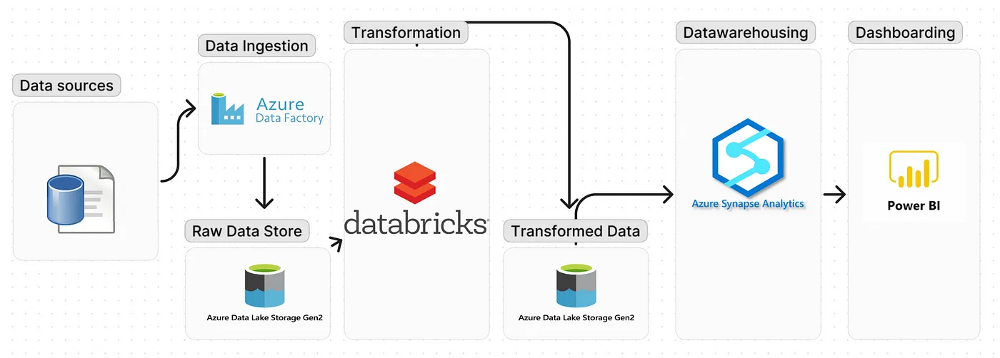
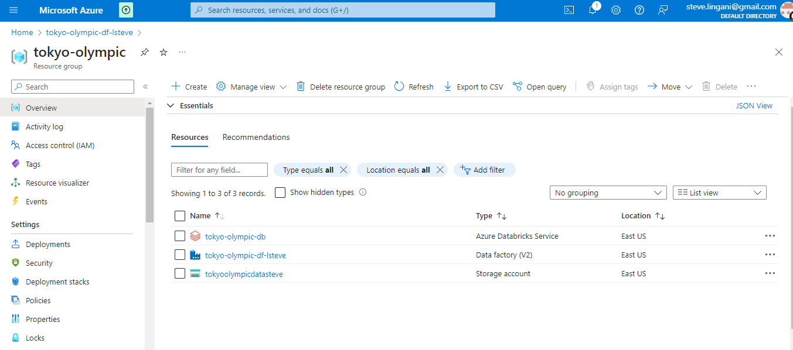
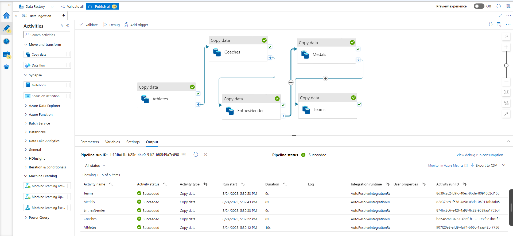
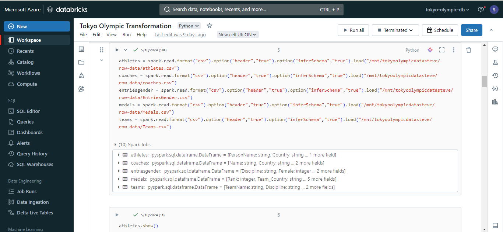

# Data engineering project: Tokyo Olympic ETL using Azure 

The Tokyo Olympic Data Analysis on Azure initiative offers an extensive approach to examining and presenting Olympic Games data through Azure's diverse services. Its goal is to demonstrate how cloud computing and Azure's data tools can be utilized to extract insights from past Olympic records. Through the integration of Azure Databricks, Azure Data Factory, and other Azure components, this project offers a flexible and effective means to handle, modify, and scrutinize substantial amounts of Olympic-related data.

# Table of Contents

- [Introduction](#Introduction)
- [Architecture](#Architecture)
- [Technologies Used](#TechnologiesUsed)
- [Getting Started](#GettingStarted)
  - [Prerequisites](#Prerequisites)
- [Data Ingestion](#DataIngestion)
- [Data Processing](#DataProcessing)
- [Conclusion](#Conclusion)

# Introduction

The Olympic Data Analysis on Azure initiative illustrates the process of constructing a end-to-end data analysis pipeline on the Azure cloud platform. This encompasses the steps of ingesting unprocessed Olympic data, converting it into an appropriate structure, conducting analysis, and generating informative visual representations. Through this project, an exemplification is given on how to incorporate and leverage Azure Databricks, Azure Data Factory, and additional Azure services to accomplish these objectives.

# Architecture

The architecture of the project consists of the following components:

- Azure Databricks: Used for data processing, transformation, and analysis. It provides a collaborative and interactive environment for running Spark-based jobs.

- Azure Data Factory: Manages and orchestrates the data workflow. It is responsible for data ingestion from various sources, data transformation, and scheduling of jobs.

- Azure Storage: Serves as the data lake for storing raw and processed data. It can also host intermediate results generated during the analysis.

- Azure SQL Database: Stores the cleaned and transformed data, making it accessible for visualization and reporting.

- Power BI: Connects to the Azure SQL Database to create interactive and visually appealing dashboards for data exploration.

# Technologies Used

- Azure Databricks
- Azure Data Factory
- Azure Storage
- Azure SQL Database
- Azure Synapse Analytics

# Getting Started

## Prerequisites

- Azure subscription
- Azure Databricks workspace
- Azure Data Factory instance

# Data Ingestion

# Data Processing

The data processing stage involves cleaning and transforming raw Olympic data into a structured format suitable for analysis. This step takes advantage of Azure Databricks' distributed computing capabilities for efficient processing.

# Conclusion

The Olympic Data Analysis on Azure project demonstrates how to leverage Azure services for processing, analyzing, and visualizing large-scale data. By following the setup and guides provided in this repository, you can adapt the project to other domains and expand its functionalities. Happy analyzing!

# Credits

- This Project is inspired by the video of the [Darshil Parmar](https://www.youtube.com/@DarshilParmar) 

